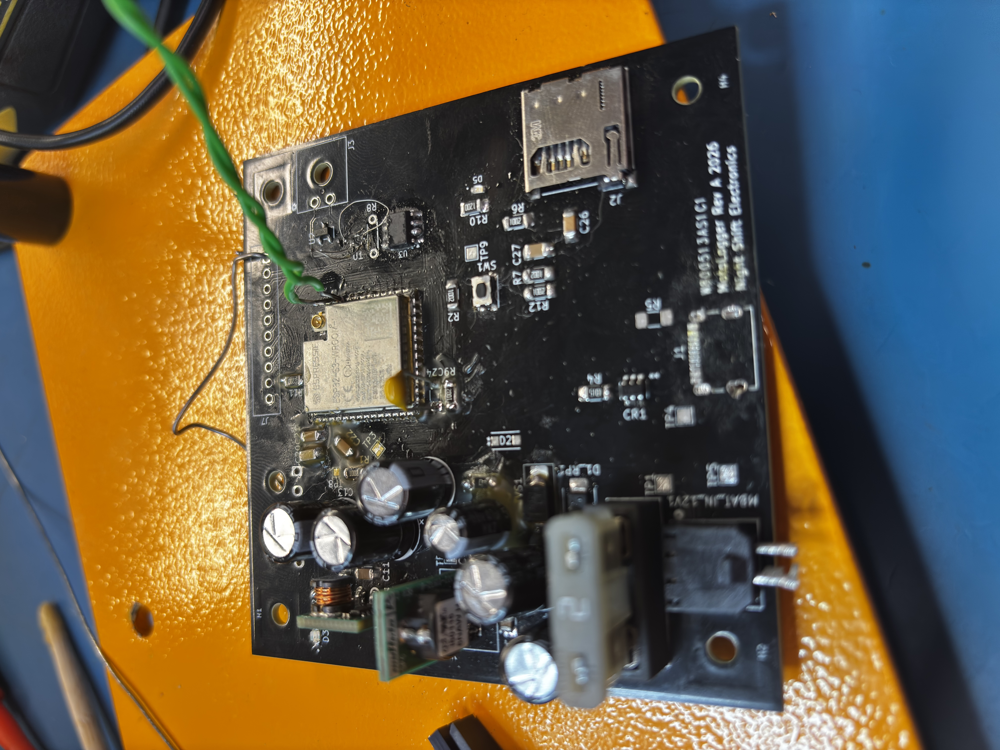
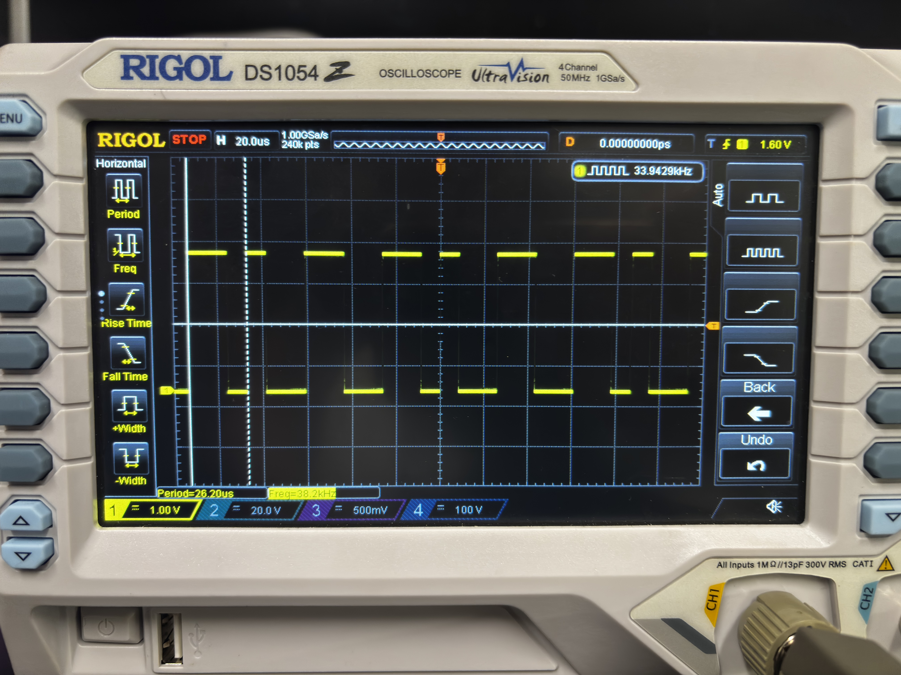

# Motologger

**Motologger** is a modular motorcycle data logger built around an ESP32-S3.  
The goal of the project is to record useful riding and vehicle dynamics data from a motorcycle that does not have a factory ECU or CAN bus.
The system is designed to collect data from external sensor modules over CAN and log it to a microSD card for later analysis.

> Current target platform: 2001 Suzuki SV650  
> Current firmware target: ESP32-S3 using ESP-IDF in C with FreeRTOS task/queue architecture

---

## Project Goals

Motologger is intended to be a compact, low-cost motorcycle telemetry system capable of logging:
- IMU data such as acceleration, gyro, and estimated lean angle
- GPS position and speed
- CAN messages from external daughterboards
- Timestamped CSV data to a microSD card
- Future expansion for additional sensors such as throttle position, brake pressure, wheel speed, and steering angle

The long-term goal is to build a modular logging and display system that can support both post-ride analysis and a future visor-mounted HUD.


---

## Current Status

**Status: PCB Bring-up and Firmware Flashing 

The prototype board has been assembled and is ready to be flashed using backup UART via ESP32 pins instead of USB-C due to anchoring issues with the receptacle. The ESP32 has been confirmed alive by both oscilloscope readings and reading TX data through TeraTerm coming from the ESP32.

Current focus:
Flashing firmware via UART to the ESP32 and confirming proper idle CAN traffic through an oscilloscope.




Hardware is in its first prototype revision and may change in future spins based on bring-up results.
---

## System Overview

The Motologger system is split into a main controller board and external sensor modules.

```text
        +--------------------+
        |    GPS Module      |
        |   u-blox M10       |
        +----------+---------+
                   |
                   | CAN
                   |
 +-----------------v-----------------+
|          Motologger Mainboard      |
|                                    |
| ESP32-S3-WROOM                     |
|  Power Stage (fuse/TVS/Schottky,   |
|    12V→5V→3.3V regulation)         |
|  microSD Card                      |
|  CAN Transceiver                   |
|  USB-C Debug/Programming           |
|  12V Motorcycle Power Input        |
 +-----------------^-----------------+
                   |
                   | CAN
                   |
        +----------+---------+
        |     IMU Module     |
        |   ICM-20948        |
        +--------------------+
